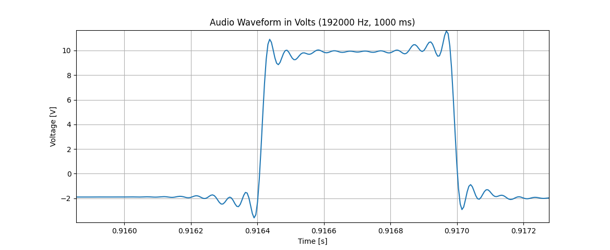

### Disclaimer
**This setup is not a replacement for a professional oscilloscope. Using your sound card for tasks it's not designed for may cause damage to your hardware. Use with caution, and proceed at your own risk.**

---

### Turn Your Sound Card Into an Oscilloscope!

To be clear, this won’t work well due to the low-pass filter commonly applied to sound cards. The waveform shown in the image below is actually a 38kHz carrier frequency, but the filter smoothed it into a constant "one." Even with a 192kHz sampling rate, it still makes for a very poor oscilloscope.

This image was produces by capturing IR remote control LED. I just removed the LED from the device, and soldered old huitar cable instead. Guitar cable goes to TRS input of soundcard.

### Be Careful with Input Voltage

My sound card supports line-level input (~1.3V) or instrument-level input (even lower). With gain adjustment, it's possible to capture signals up to 3V, though I haven’t tested higher voltages. Regardless, I’m confident that trying to use this "oscilloscope" with 220V will result in your device exploding. Always measure the voltage level before connecting anything to your sound card.
